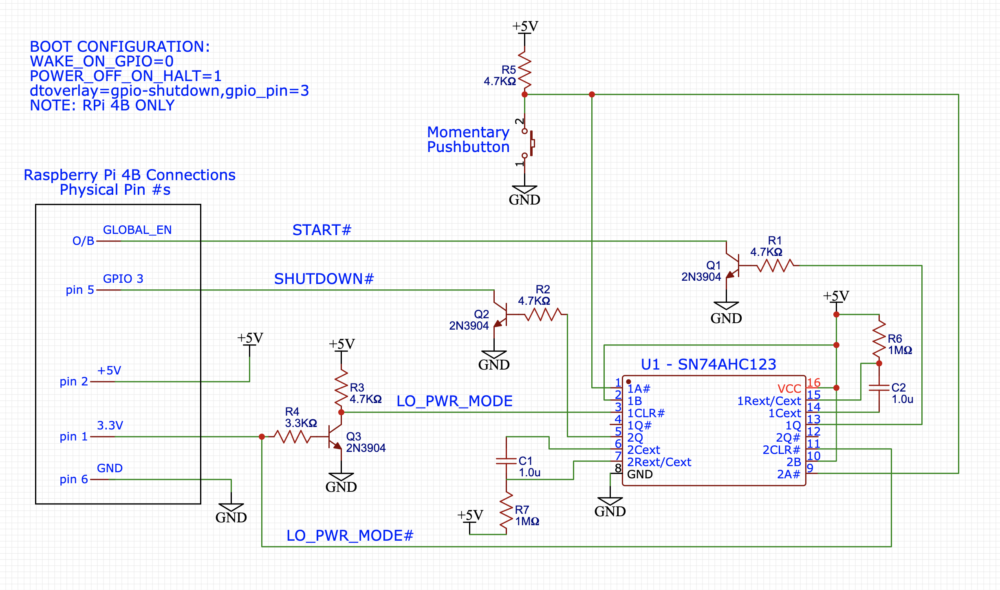

## A Low Power Startup/Shutdown Button for RPi 4B


The *"one-button-startup-shutdown"* (**OBSS**) feature for Raspberry Pi has been around for a while, and works on almost all RPi hardware versions. [Matthijs Kooijman's blog post from July, 2017 - Raspberry pi powerdown and powerup button](https://www.stderr.nl/Blog/Hardware/RaspberryPi/PowerButton.html) showed how easily this could be implemented. I was impressed by the simplicity of this feature, and implemented it on my Raspberry Pi 4B. However...

As Matthijs pointed out in his blog, the OBSS doesn't remove power from the RPi, and so it continues to draw power in shutdown - just as all RPis do after receiving a `halt`, a `shutdown` or a `poweroff` command. In my case the RPi 4B draws approximately 370mA, or just under 2 watts of power. But since the RPi 4B draws approximately 500mA / 2.5 watts when it is running, there's little incentive for using the OBSS. 

One of the features introduced in the RPi 4B is a [*"Low Power Mode" (**LPM**)*](https://github.com/seamusdemora/PiFormulae/blob/master/RPi4bSleep.md).  LPM reduces power consumption to approximately 0.2 watts - a current draw of about 40mA. AFAIK, this is the lowest achievable power consumption for the RPi 4B without "pulling the plug".  Unfortunately, returning to the operational mode from LPM is only possible by pulling down the `GLOBAL_EN` node, or "pulling and re-inserting the plug" - `GLOBAL_EN` is not a GPIO, nor can it be assigned to a GPIO.  In other words, unlike OBSS, LPM cannot be entered and exited from the same pin on the RPi. 

One solution to this problem is shown in the following schematic. The concept is simple: We connect the pushbutton to the trigger inputs on a pair of *"one-shots"*. We take advantage of the fact that the RPi 4B's `3V3` bus is powered down during LPM, and wire the `3V3` line to enable only one of the one-shot's outputs.  One of these outputs is wired to GPIO 3 for shutdown, the other is wired to `GLOBAL_EN`  for startup. 




There is also an additional configuration assignment required. The OBSS required the following `dtoverlay` in `/boot/config.txt`: 

```
dtoverlay=gpio-shutdown,gpio_pin=3
```

The Low Power OBSS requires the following parameters also be set  in the EEPROM configuration: 

```
WAKE_ON_GPIO=0 
POWER_OFF_ON_HALT=1
```

See the applicable instructions in the  ["Low Power Mode" recipe](https://github.com/seamusdemora/PiFormulae/blob/master/RPi4bSleep.md), or follow the "official documentation" for [Raspberry Pi 4 Bootloader Configuration](https://www.raspberrypi.org/documentation/hardware/raspberrypi/bcm2711_bootloader_config.md).  