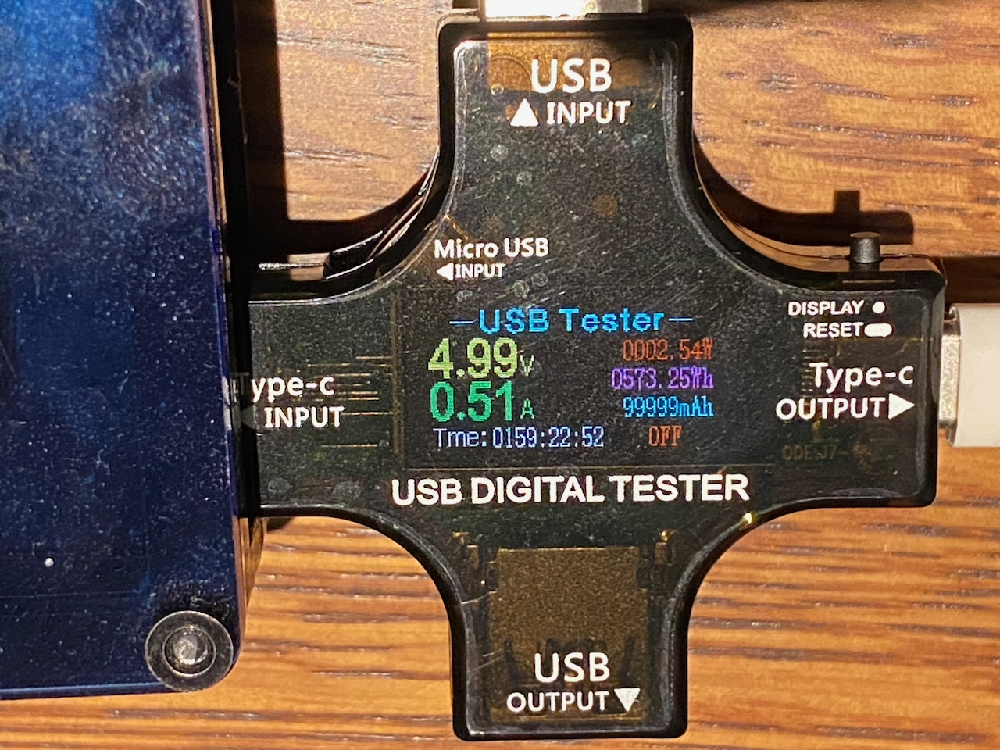
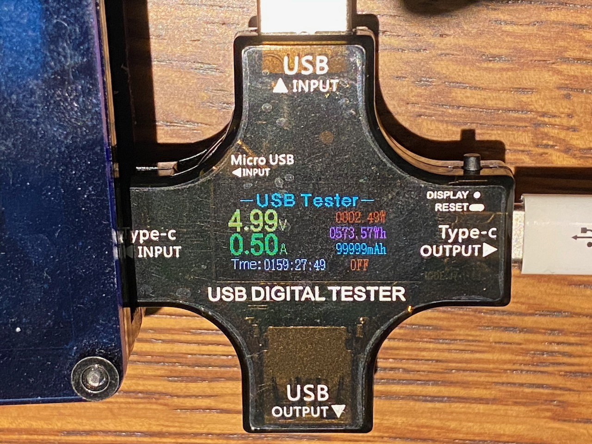

## Minimize Raspberry Pi 4B Power Consumption in `poweroff`

This all started when I read a post made by a "Raspberry Pi Engineer" in the Raspberry Pi Organization's forum. [In this post, dated June 24, 2019](https://www.raspberrypi.org/forums/viewtopic.php?p=1484347#p1484347) it was claimed: 

>"sudo poweroff" will shut down the PMIC at the  conclusion of the shutdown sequence. This reduces power consumption to  about 3mA but requires pulling GLOBAL_EN low (or cycling input power) to wake the PMIC up.
>
>There's user-modifiable EEPROM setting to change this behaviour (halt  instead of poweroff, allows GPIO pin wake) but these are currently  deliberately undocumented until we have a reliable, scripted way to  change these.

More than a year and several firmware revisions later `sudo poweroff` still results in a current drain of approximately 370mA on my RPi 4b. That's just under 2 Watts - enough to make a Raspberry Pi 4B a nice hand-warmer on a frosty day. ***What happened?!*** 

During a [SE Q&A](https://raspberrypi.stackexchange.com/questions/114092/does-raspberry-pi-4-consume-considerable-amount-of-power-in-soft-off-state) I became aware of this addition to the Raspberry Pi documentation: [Pi 4 Bootloader Configuration](https://www.raspberrypi.org/documentation/hardware/raspberrypi/bcm2711_bootloader_config.md). Their documentation implies that changing certain bootloader EEPROM values will disable the PMIC after a `halt` command, resulting in the *"lowest possible power state"*. That seems a curious choice of words, and a rather *"slippery" bit of specsmanship*. We'll try to do better than that in the sequel below. 

### Why does this work only on RPi 4?

The RPi 4B represents a break from previous models in that boot code is stored in EEPROM on the board. The boot code for Raspberry Pi 4 is now resident in the hardware - instead of in the `bootcode.bin` file on the SD card - as it is for all previous models of the Raspberry Pi. This page in *"The Organization's"* documentation on the [Raspberry Pi 4 boot EEPROM](https://www.raspberrypi.org/documentation/hardware/raspberrypi/booteeprom.md) explains the motivation for this change. This change also prompts us to consider the possibility of error during EEPROM modification, and to have a [recovery plan](#recovery-plan) **before** an error occurs. 

### Make the change:

***But first...*** You should review "The Organization's" documentation on [Pi 4 Bootloader Configuration](https://www.raspberrypi.org/documentation/hardware/raspberrypi/bcm2711_bootloader_config.md) before proceeding here, if only to confirm these instructions are still valid. This is a *"new era"* for Raspberry Pi, and there may be changes that supersede these procedures. As you'll see, changing the boot configuration is not complicated, but improving one's forward visibility is always prudent. 

#### 1. Show the current EEPROM bootloader configuration: 

  ```bash
$ vcgencmd bootloader_config
BOOT_UART=0
WAKE_ON_GPIO=1
POWER_OFF_ON_HALT=0
FREEZE_VERSION=0
  ```

***NOTE:*** `vcgencmd bootloader_config` **MAY NOT** list all the editable config variables. The EEPROM firmware (boot code) is very much in a state of flux as of this writing, and the set of configuration variables is changing.

The values of interest here are: `WAKE_ON_GPIO` and `POWER_OFF_ON_HALT`. Disabling the PMIC in `halt` mode requires these values be set as follows: 

  * **WAKE_ON_GPIO=0** 
  * **POWER_OFF_ON_HALT=1** 

#### 2. Edit the EEPROM bootloader configuration:

Raspberry Pi 4 has some new tools for managing the bootloader configuration: `rpi-eeprom-config` and `rpi-eeprom-update`. The first one we'll use is `rpi-eeprom-config` - see the `man` pages for details. Here's the procedure to follow:

##### 2.1 make a local copy of the current EEPROM bootloader firmware file:

   `man rpi-eeprom-update` tells us where to look for our EEPROM firmware files:
  >  >**Release status:**
  >  >
  >  >**critical**: The latest production release plus important security or hardware compatibility bug fixes.
  >  >
  >  >**stable**:  Contains new features that have already undergone some beta testing.  These are candidates for new production releases.
  >  >
  >  >**beta**: New features, bug fixes for development/test purposes. Use at your own risk!

   After some *rummaging*, I elected to use the 2020-06-15 version from `stable`, rather than the 2020-04-16 version from `critical` 

```bash
$ cp /lib/firmware/raspberrypi/bootloader/stable/pieeprom-2020-06-15.bin ./pieeprom.bin

# we now have a copy of the bootloader firmware in the `pwd` named `pieeprom.bin`
```

##### 2.2 extract configuration variables from local copy of bootloader firmware file:

Use the tool `rpi-eeprom-config` to extract the configuration variables to a text file:

  ```bash
$ rpi-eeprom-config pieeprom.bin > boot_lowpwr.txt
  ```

##### 2.3 edit the text file conatining the configuration variables 

```bash
$ nano boot_lowpwr.txt

# set WAKE_ON_GPIO=0 
# set POWER_OFF_ON_HALT=1
```

save the changes, exit `nano` 

##### 2.4 revise the local copy of bootloader firmware file with the revised configuration file

Use the tool `rpi-eeprom-config` to create a revised bootloader firmware file using the revised configuration:

 ***pieeprom.bin + boot_lowpwr.txt  →  pieeprom-lopwr.bin***

*accomplished as follows:*

```bash
$ rpi-eeprom-config --out pieeprom-lopwr.bin --config boot_lowpwr.txt pieeprom.bin
```

#### 3. Flash the EEPROM with the revised bootloader firmware file:

Use the tool `rpi-eeprom-update` to flash the EEPROM with the revised configuration:

  ```bash
$ sudo rpi-eeprom-update -d -f ./pieeprom-lopwr.bin
BCM2711 detected
Dedicated VL805 EEPROM detected
BOOTFS /boot
*** INSTALLING ./pieeprom-lopwr.bin  ***
BOOTFS /boot
EEPROM update pending. Please reboot to apply the update.
$ sudo reboot
  ```

The `reboot` should load the modified values into the bootloader EEPROM.

#### 4. Test the change:

The EEPROM firmware has now been modified, and the system has booted with this modified firmware: 

* from `critical/pieeprom-2020-04-16.bin` to `stable/pieeprom-2020-06-15.bin` 

* values of `WAKE_ON_GPIO` and `POWER_OFF_ON_HALT` have been modified to minimize power consumption in `halt`

If the system failed to `reboot`, execute the [Recovery Plan](#recovery-plan) & repeat the steps above after determination of the mis-step. 

How did these modifications affect power consumption? See the results in the table below:

> NOTE: All measurements made with Ethernet cable connecting RPi 4 to Ethernet Switch. 

| BEFORE BOOTLOADER MODIFICATION                               | AFTER BOOTLOADER MODIFICATION                                |
| ------------------------------------------------------------ | ------------------------------------------------------------ |
| `critical/pieeprom-2020-04-16.bin`                           | `stable/pieeprom-2020-06-15.bin`                             |
| `WAKE_ON_GPIO=1`                                             | `WAKE_ON_GPIO=0`                                             |
| `POWER_OFF_ON_HALT=0`                                        | `POWER_OFF_ON_HALT=1`                                        |
| Measured current while running: 0.51A                        | Measured current while running: 0.50A                        |
|  |  |
| Measured current after `halt`/`poweroff`: 0.37A              | Measured current after `halt`/`poweroff`: 0.04A              |
|  |  |

#### 5. Summary 

That's a 90% reduction in power consumption in `halt`/`poweroff` mode. It's certainly an improvement, but especially given the initial claim, it is also very disappointing! Not only is it an [order of magnitude greater than claimed by "Raspberry Pi Engineer"](https://www.raspberrypi.org/forums/viewtopic.php?p=1484347#p1484347), it's not even close to a value that would permit battery-powered operation in many remote-sensor applications. The claim was *misleading* - a *typo* or a *Raspberry Lie*? 

#### 6. Revert to original firmware - OPTION

If you wish to restore your original EEPROM bootloader configuration: 

```bash
$ sudo rpi-eeprom-update -d -f /lib/firmware/raspberrypi/bootloader/critical/pieeprom-2020-04-16.bin 
...
$ sudo reboot
```


### Recovery Plan

In the event something goes wrong, let's marshal the resources needed for recovery of the boot EEPROM before making any changes to the existing configuration :

* [Instructions](https://www.raspberrypi.org/documentation/hardware/raspberrypi/booteeprom.md) in the `Recovery image` section state: 

  >If the Raspberry Pi is not booting it's possible that the bootloader  EEPROM is corrupted. This can easily be reprogrammed using the Raspberry Pi Imager tool which is available via the [raspberrypi.org downloads page](https://www.raspberrypi.org/downloads/). 
  >
  > Using the recovery image will erase any custom configuration options, resetting the bootloader back to factory defaults.

* Download the `.zip` file containing the [latest production recovery image](https://github.com/raspberrypi/rpi-eeprom/blob/master/releases.md) to your workstation

* Format a micro SD card (NTE 32GB) using `FAT32` (not exFAT!... FAT32!)

* Unzip the the downloaded recovery image to a folder & copy all files in this folder to the root of the FAT32-formatted micro SD card. 

* Read the instructions in the `README` file, esp: 

    >To re-flash the EEPROM
    >
    >1. Unzip the contents of this zip file to a blank FAT formatted SD-SDCARD.
    >2. Power off the Raspberry Pi
    >3. Insert the sd-card.
    >4. Power on Raspberry Pi
    >5. Wait at least 10 seconds.
    
* Once the files are copied to the micro SD card, set it aside in the event that it is needed.

---

## OTHER REFERENCES:

1. [Raspberry Pi 4 Bootloader Firmware Updating / Recovery Guide](https://jamesachambers.com/raspberry-pi-4-bootloader-firmware-updating-recovery-guide/) from  James Chambers' *Legendary Technology Blog* 
2. [The Foundation's GitHub page for *device tree overlays*](https://github.com/raspberrypi/firmware/blob/master/boot/overlays/README) - everything you wanted to know, but ... 
3. [An RPi Forum post with some insights on the *raison d'etre* for the device tree](https://www.raspberrypi.org/forums/viewtopic.php?t=97314) 

<!--- 

You can hide shit in here  :)   LOL 


[RPi firmware update and recovery guide](https://jamesachambers.com/raspberry-pi-4-bootloader-firmware-updating-recovery-guide/) 

the recovery tool to reflash your bootloader if something goes wrong 


For your RPi to remain warm after an hour would *"probably"* require the CPU still be running, although it could be due to the power management IC. These seem to be the hottest components, based on [this study](https://www.tomshardware.com/news/raspberry-pi-4-firmware-update-tested,39791.html):

[![enter image description here][1]][1]

Keep in mind this image is an *operating* RPi 4B - i.e. not in `shutdown` mode. 

There are a couple of things to know as "background" to your question: 

1. RPi is not an open system. Yes, some of the circuitry is documented, but some is not. The firmware is closed-source. This makes definitive answers to questions such as yours difficult - if not impossible. 

2. At this time, there is no true "**sleep mode**" on any RPi - this has been the subject of *much* discussion over the years. I refer to **sleep mode** as an extremely low power mode (on the order of a milliamp or less) from which it is possible to awake and resume operations ([as defined here](https://en.wikipedia.org/wiki/Sleep_mode)). 

I have a true *headless* RPi 4B - that is to say that the "Lite" version of Raspbian is installed, and is incapable of running in *GUI* mode. The shutdown button you describe in your question may be different than `sudo shutdown` that I enter from the command line... this would surprise me, but it *could be*. 

I attempted to replicate your result, except I left the ethernet cable plugged in. I entered `sudo shutdown`, and when my SSH connection was interrupted, I started a timer on my phone. The ethernet status lights continued to flicker, and the "red light" was on the entire time. On my headless RPi 4B, one hour after running `sudo shutdown`, I can not detect anything that feels warmer than ambient. 

There's an [interesting thread](https://www.raspberrypi.org/forums/viewtopic.php?p=1484347#p1484330) in the RPi.org forum on "sleep mode" for the Raspberry Pi 4B. Synopsized below are some of the more interesting posts in that thread: 

* a [**RPi Engineer** claims](https://www.raspberrypi.org/forums/viewtopic.php?p=1484347#p1484347): 
  * power consumption in `shutdown`<sup>Note 1</sup> is "about 3 mA" !?
  * there are *undocumented* methods for changing the current behavior


[1]: https://i.stack.imgur.com/C4sLZ.png

---
Note 1: The actual claim is for `poweroff`, **but** `man shutdown` tells us that `shutdown` defaults to `poweroff`; i.e. they are the same state.


--->
