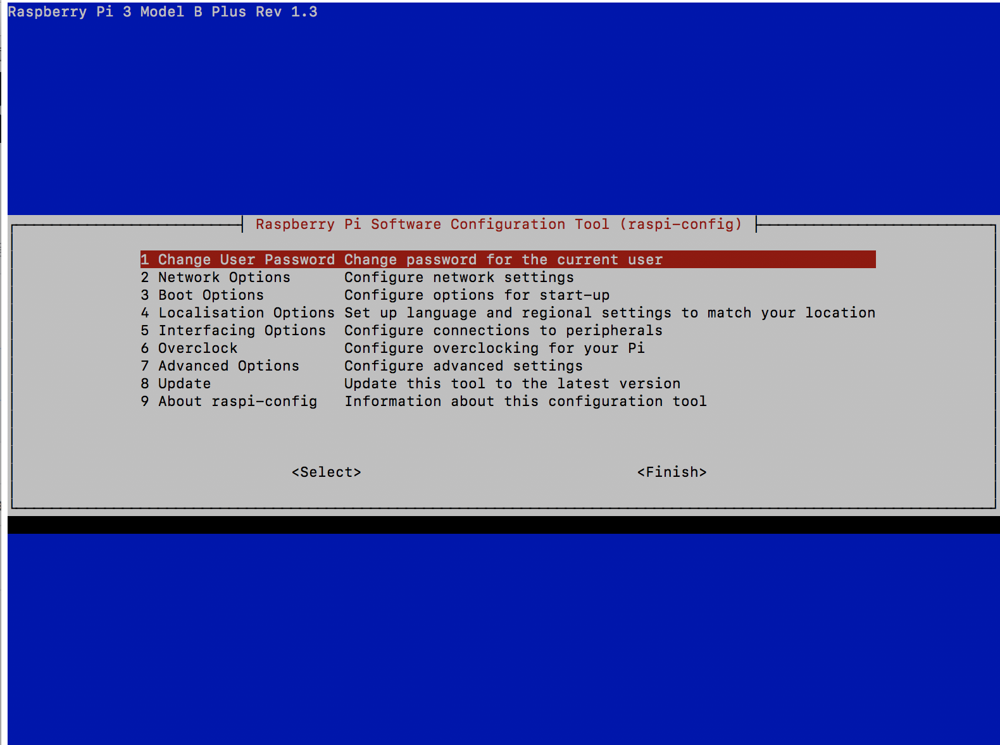

# Setup Raspberry Pi for Headless Operation

It seems that a lot of people follow instructions to set up their microSD card (Raspberry Pi's 'hard drive'), but don't give much thought to what comes afterwards. That's understandable, and it's generally not that big a deal if you're connecting a keyboard, mouse and TV/monitor. In the "GUI" environment, you can issue commands to your RPi, and there are tools and tips and cues to point you toward connecting to your network, and other basic tasks that users typically perform. 

However, some users don't want to (or aren't able to) connect keyboards, mice and monitors. This is how I usually do it; I run my RPi's ["headless"](https://en.wikipedia.org/wiki/Headless_computer)... I have one "head" on my MacBook, and I don't want any more heads to deal with :)  I personally feel that's "how it should be", but after living with the Raspberry Pi 3B+ for a short while, I can easily see that it's not inconceivable that an RPi 3B+ could serve as a general purpose PC for some users; surfing the Internet, email, etc. All that power for £32! 

But I digress. Here, for what it's worth, is how I do things: 

## Download the Raspbian Image, and Burn It to the microSD Card 

1. Download the [latest Raspbian image file from the Raspberry Pi website](https://www.raspberrypi.org/downloads/raspbian/)

2. Choose your weapon: There are several methods & tools that may be used to copy the Raspbian image file to your microSD card:
  * you can [do it manually in Mac, Windows or Linux/Unix](https://www.wikihow.com/Make-a-USB-Bootable)
  * you can use [rufus](https://rufus.akeo.ie/) on your Windows PC 
  * you can use [Etcher](https://etcher.io/) on Mac or Windows

3. "Burn" the Raspbian image file to the media you're going to boot from. Typically, this will be an 8 GB or larger [microSD](https://simple.wikipedia.org/wiki/MicroSD) memory card.

## Modify files in `/boot` on the micro SD card

One **really** nice idea the raspbian project team has implemented is placing the /boot drive in a FAT partition. The reason behind this was so that the RPi could boot using a text file rather than BIOS, saving costs, etc. The ancillary benefit is that this decision allows us to do the following from our Windows/Mac/Linux PC: 

  1. open the /boot partition of the microSD card just created in Finder/Explorer/whatever-file-manager
  2. create an empty file named `ssh` in `/boot`. This will allow us to connect to our RPi via SSH! 
  3. if you want to use your RPi on your WiFi network, open the file `/boot/wpa_supplicant.conf`, and add the following: 
  
    ctrl_interface=DIR=/var/run/wpa_supplicant GROUP=netdev
    update_config=1

    network={
     ssid="SSID of your 2.4 GHz wifi network"
     psk="password for your wifi network"
     scan_ssid=1
    }
    
Once you've made these changes, `eject/umount` the microSD card. 

## Insert the microSD card into your RPi & apply power

If you configured WiFi as in Step 3 above,your RPi should boot successfully, and connect itself to your WiFi network. If you didn't configure WiFi, connect your RPi to your wired network using a standard Ethernet patch cable. 

In either case, before you initiate an SSH connection to your new RPi, you may need to know its IP address on the network. If you're on a "zero configuration" network, things may "just work", and your first login is as simple as `ssh pi@raspberrypi.local`. Try that; if it works, [go to the next step](https://github.com/seamusdemora/PiFormulae/blob/master/ReadMeFirst.md#login-to-your-RPi-using-SSH). If not, no worries as there are numerous ways to get it done: 

  * `dns-sd -q raspberrypi.local` (OS X only)
  * `arp -a | grep --ignore-case b8:27:eb` (because as of this writing all RPi MAC addresses begin with `b8:27:eb`)
  * `arp raspberrypi.local`
  * if you have access to it, look through the network's DHCP server log 
  * I've developed this ["recipe" for IP address discovery](https://github.com/seamusdemora/PiFormulae/blob/master/FindMyPi.md) 
  
Note: Using a [simple `arp` will be "hit-or-miss"; here's why](https://github.com/seamusdemora/PiFormulae/blob/master/ThinkingAboutARP.md) that's so. If you've reached the end of the list, and you still don't have your Pi's IP address, then something may be broken or misconfigured. Try [one of the forums](https://raspberrypi.stackexchange.com/) for support, and as always, please try to be as specific as you can in describing your problem.  
  
## Login to your RPi using SSH

1. Open a terminal on your PC, and initiate a connection to your RPi using SSH: 

`ssh pi@raspberrypi.local` or, use the RPi's IP address: `ssh pi@192.168.1.77` (for example) if that's handy

2. Enter the default password at the prompt: `raspberry` 

3. Start raspi-config as su:  `sudo raspi-config`  and you'll see something like this: 

 

4. The "arrow keys" will move you through the menu items, the "Tab" key will move you between screens. Go to `Interfacing Options`You'll want to make the following "stops": 

    a. Change the default password 
    
    b. Set up WiFi networking if you want; you'll need to know the WiFi `SSID` and `password`
    
    c. Go to `Boot Options` -> `Desktop CLI -> `Console`; tab to `OK`, then `Return`
    
    d. Go to `Localisation Options`, and select the appropriate values from the lists provided
    
    e. Go to `Interfacing Options` -> `SSH`, and select `YES`, There are a lot of options on this page; you can set them now, or return to them later. 
    
    f. Go to `Advanced Options` -> `Expand Filesystem. You may wish to expand the file system to use all available storage on the microSD card. This is probably a good idea for most users. Note the other choices here, and you may return later to change them. 
    
    g. You may wish to try updating `raspi-config` by selecting the `Update` option. If you do so, this will temporarily close the raspi-config window, check for an update, and then automatically return you to raspi-config. 
    
    h. Tab to the `Finish` option at the bottom of the page and return to the command prompt. Congratulations, we're done here! 
    
